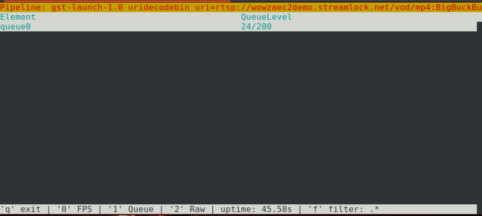

# SharkTop

A Python Curses-based UI for GstShark.

Displays information by launching a pipeline using GstShark or attaching to a currently running GStreamer+GstShark pipeline.

FPS Panel                  | QueueLevel Panel
:-------------------------:|:-------------------------:
         | 

## Notice

This is a personal project in the development phase. I'll be happy to read your bug-reports, issues, suggestions, or feature requests in the issues section.

## Installation

### Prerequisites
1. GStreamer 1.x
2. GstShark
3. Psmisc (apt install psmisc)
4. Python 3.x

### Install prerequisites

Use dockerfile or refer to the instructions inside dockerfile for standalone installation

```bash
docker build -f dockerfile_gstreamer_gstshark_x86 -t sharktop .

docker run -it --rm -v $(pwd):/src sharktop bash
```

### Install sharktop

install directly using pip:
```bash
python3 -m pip install git+https://github.com/sandstorm12/SharkTop.git
```

## Usage

Intercepting currently running pipeline (based on peekfd):
```bash
# Launch your pipeline with GstShark enabled and requireed tracers selected
GST_DEBUG="GST_TRACER:7" GST_TRACERS="framerate;queuelevel" [pipeline or pipeline launching code]

GST_DEBUG="GST_TRACER:7" GST_TRACERS="framerate;queuelevel" gst-launch-1.0 uridecodebin uri="rtsp://wowzaec2demo.streamlock.net/vod/mp4:BigBuckBunny_115k.mov" ! queue ! videoconvert ! fakesink sync=True -p "queue|videoconvert"

# Find the gstreamer process's pid using ps, top, htop, or other tools
ps -aux | grep gst-launch-1.0

sharktop -p [gstreamer process pid]
```

Launching pipeline using sharktop:
```bash
sharktop -i [pipeline or pipeline launching code]

sharktop -i gst-launch-1.0 videotestsrc ! fakesink sync=True

sharktop -i gst-launch-1.0 uridecodebin uri="rtsp://wowzaec2demo.streamlock.net/vod/mp4:BigBuckBunny_115k.mov" ! queue ! videoconvert ! fakesink sync=True

sharktop -i gst-launch-1.0 uridecodebin uri="rtsp://wowzaec2demo.streamlock.net/vod/mp4:BigBuckBunny_115k.mov" ! queue ! videoconvert ! fakesink sync=True -p "queue|videoconvert"

sharktop -i python run_pipeline.py
```

## Urgent issues
1. Remove the redundant image folder

## Issues and future work
1. Install sharktop inside the dockerfile by default
2. A serious refactor is required
3. Scrollable pipeline description
4. Add more tracers
5. Add images to the readme
6. Sort the lists
7. Upload to pypi
8. Add version argument
9. Attach to other GstShark processes
10. Add mouse support
11. Print readily runable pipeline

## Contributors
1. Hamid Mohammadi <sandstormeatwo@gmail.com>
